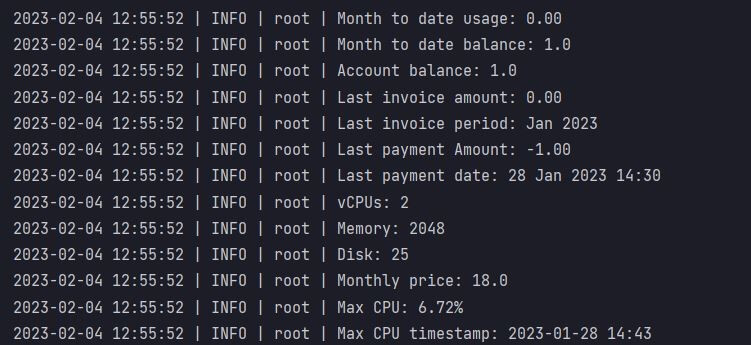
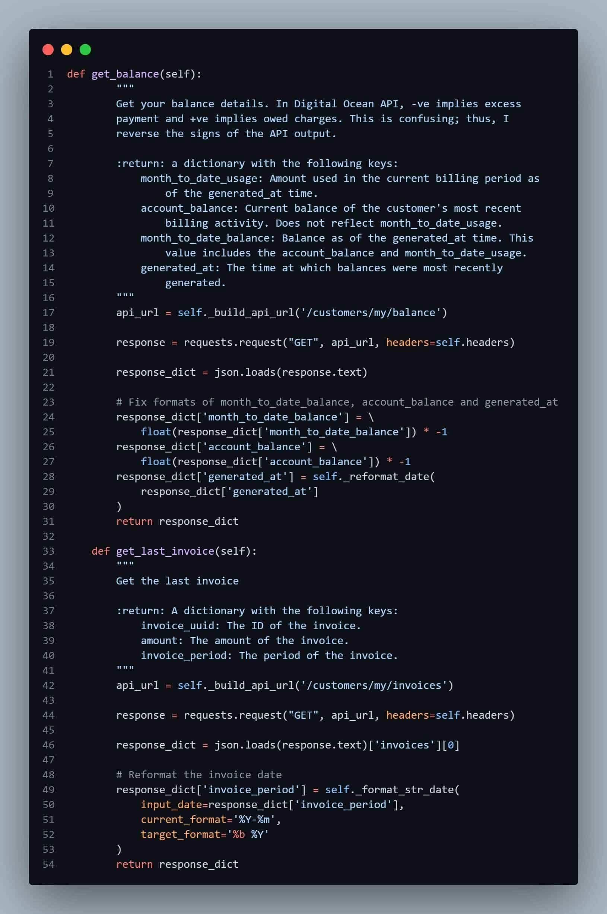

<!-- PROJECT SHIELDS -->
<!--
*** I'm using markdown "reference style" links for readability.
*** Reference links are enclosed in brackets [ ] instead of parentheses ( ).
*** See the bottom of this document for the declaration of the reference variables
*** for contributors-url, forks-url, etc. This is an optional, concise syntax you may use.
*** https://www.markdownguide.org/basic-syntax/#reference-style-links
-->

<a name="readme-top"></a>

[![LinkedIn][linkedin-shield]][linkedin-url]


<!-- PROJECT LOGO -->
<br />
<div align="center">
    

  <h3 align="center">Digital Ocean Automated Billing And Server Report</h3>

</div>


<!-- TABLE OF CONTENTS -->
<details>
  <summary>Table of Contents</summary>
  <ol>
    <li>
      <a href="#about-the-project">About The Project</a>
      <ul>
        <li><a href="#built-with">Built With</a></li>
      </ul>
    </li>
    <li>
      <a href="#getting-started">Getting Started</a>
      <ul>
        <li><a href="#libraries">Libraries</a></li>
        <li><a href="#packages">Packages</a></li>
        <li><a href="#service-accounts">Service Accounts</a></li>
        <li><a href="#known-exceptions">Known Exceptions</a></li>
      </ul>
    </li>
    <li><a href="#usage">Usage</a></li>
    <li><a href="#roadmap">Roadmap</a></li>
    <li><a href="#license">License</a></li>
    <li><a href="#contact">Contact</a></li>
  </ol>
</details>


<!-- ABOUT THE PROJECT -->
## About The Project



* Project Name: Digital Ocean Automated Billing And Server Report
* Version: v1.0.0
* Organization Department: Technology

### Description

While I am developing my website's admin dashboard, I wanted to include monitor
my cloud server usage. Thus, I developed a Python package to integrate with 
Digital Ocean API and extracted the following information:
* Month to date usage
* Month to date balance
* Account balance
* Last invoice amount
* Last invoice period
* Last payment amount
* Last payment date
* Server Technical specifications:
  * vCPUs
  * RAM Memory
  * Storage Disk
  * Monthly price

<p align="right">(<a href="#readme-top">back to top</a>)</p>


### Built With

This project was developed using the following tech stacks:

* Python

<p align="right">(<a href="#readme-top">back to top</a>)</p>


<!-- GETTING STARTED -->
## Getting Started

In this section, I will give you instructions on setting up this project locally.
To get a local copy up and running follow these simple steps.

### Libraries

* pip
  ```sh
  pip install PyYAML
  ```
  ```sh
  pip install requests==2.28.2
  ```

### Packages
* digitalOcean
* Logger
* file

### Service Accounts
* None

### Known Exceptions
* None

<p align="right">(<a href="#readme-top">back to top</a>)</p>


<!-- USAGE EXAMPLES -->
## Usage

### Screenshots



<p align="right">(<a href="#readme-top">back to top</a>)</p>


<!-- ROADMAP -->
## Roadmap

- [x] Clean structure.
- [x] Attractive README template.
- [x] Configuration Yaml file and the code for importing it inside the project.
- [x] Logger package with its setup inside the project and inside the packages of the project.
- [x] Month to date usage
- [x] Month to date balance
- [x] Account balance
- [x] Last invoice amount
- [x] Last invoice period
- [x] Last payment amount
- [x] Last payment date
- [x] Server Technical specifications:
  - [x] vCPUs
  - [x] RAM Memory
  - [x] Storage Disk
  - [x] Monthly price

[//]: # (- [ ] Max CPU usage)

[//]: # (- [ ] Max CPU timestamp)

[//]: # (- [ ] CPU usage data)

[//]: # (- [ ] Max RAM memory usage)

[//]: # (- [ ] Max RAM memory timestamp)

[//]: # (- [ ] RAM memory usage data)

[//]: # (- [ ] Free Disk Storage)

[//]: # (- [ ] Used Disk Storage)

[//]: # (- [ ] Inbound Bandwidth)

[//]: # (- [ ] Outbound Bandwidth)
 
<p align="right">(<a href="#readme-top">back to top</a>)</p>

<!-- LICENSE -->
## License

Distributed under the MIT License. See `LICENSE.txt` for more information.

<p align="right">(<a href="#readme-top">back to top</a>)</p>


<!-- CONTACT -->
## Contact

Mohamed AbdelGawad Ibrahim - [@m-abdelgawad](https://www.linkedin.com/in/m-abdelgawad/) - <a href="tel:+201069052620">+201069052620</a> - muhammadabdelgawwad@gmail.com

GitHub Profile Link: [https://github.com/m-abdelgawad](https://github.com/m-abdelgawad)

<p align="right">(<a href="#readme-top">back to top</a>)</p>


<!-- MARKDOWN LINKS & IMAGES -->
<!-- https://www.markdownguide.org/basic-syntax/#reference-style-links -->
[linkedin-shield]: https://img.shields.io/badge/-LinkedIn-black.svg?style=for-the-badge&logo=linkedin&colorB=555
[linkedin-url]: https://www.linkedin.com/in/m-abdelgawad/
